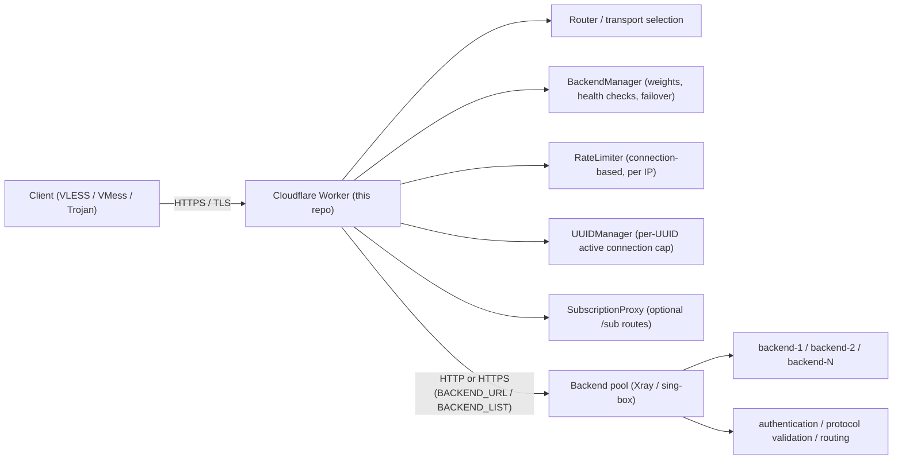

  
  &nbsp;+&nbsp;
  

  
  
  
  

# cf-xray-proxy

Cloudflare Worker reverse-proxy frontend for VLESS, VMess, and Trojan traffic, forwarding `ws`, `xhttp`, and `httpupgrade` requests to an Xray or sing-box backend.

## What this project is

This repository provides a Worker entrypoint (`src/index.ts`) plus transport handlers (`src/transports/*`) that:

- accept inbound HTTP/Upgrade requests at Cloudflare edge,
- select a transport handler (`ws`, `xhttp`, or `httpupgrade`),
- forward path/query to backend as-is,
- bridge upgraded sockets between client and backend.

The backend remains the protocol/authentication authority.

## Why you would use it

- Put Cloudflare edge in front of an existing Xray/sing-box backend.
- Terminate TLS at the edge while keeping origin/backend on plain HTTP.
- Select transports per request via query/header/path without redeploying.
- Keep Worker logic thin and backend-focused for VLESS/VMess/Trojan validation and policy.

## Features

- Multi-backend support with weighted selection and automatic failover.
- Periodic backend health checking with auto-recovery.
- Exponential backoff retry with jitter for backend retries.
- Connection-based rate limiting (per-IP concurrent and per-minute attempts).
- UUID-based maximum active connection limiting.
- Optional subscription proxy (`/sub/...`) with in-memory caching (disabled by default).
- Built-in observability endpoints: `GET /health` and `GET /status` (when `DEBUG=true`).
- `GET /health` hides backend URLs/addresses by default via `HIDE_BACKEND_URLS=true`.

## Architecture

> TLS terminates at Cloudflare Worker edge. `BACKEND_URL` and each `BACKEND_LIST` entry can be `http://...` or `https://...`.

## Supported transports

| Transport | Handler file | Upgrade detection | Notes |
| --- | --- | --- | --- |
| `ws` | `src/transports/ws.ts` | `Connection: upgrade` + `Upgrade: websocket` | WebSocket upgrade + passthrough fallback |
| `xhttp` | `src/transports/xhttp.ts` | `Connection: upgrade` + `Upgrade: websocket` | Supports `mode` (`auto`/`packet-up`) and `ed` hint |
| `httpupgrade` | `src/transports/httpupgrade.ts` | `Connection: upgrade` + any `Upgrade` value | HTTP Upgrade semantics with shared WS bridging |

### Transport selection order

Selection logic is implemented in `src/index.ts`:

1. Query parameter `transport` (`xhttp`, `httpupgrade`, `ws`)
2. Header `x-transport-type`
3. Path prefix (`/xhttp/...`, `/httpupgrade/...`, `/ws/...`)
4. Environment/default transport (`TRANSPORT`, otherwise default `xhttp`)

### ☕ Support this project

If you find this project useful, consider supporting its development:

  
  

  <strong>USDT (TRC-20):</strong> <code>TUWcBfKhmpLQBC961oCJf7zuXTN2ezMbkF</code> 
  <strong>TON:</strong> <code>UQC_4BlT2iUlliYUDDCzkDBhBPrww3plMH3XqWaWeDRXfWVj</code>

## Documentation

- [Documentation index](docs/README.md)
- [Configuration](docs/configuration.md)
- [Multi-backend setup](docs/multi-backend-setup.md)
- [Rate limiting](docs/rate-limiting.md)
- [Subscription proxy](docs/subscription-proxy.md)
- [Quickstart](docs/quickstart.md)
- [Deployment guide](docs/deployment-guide.md)

## Routing behavior

- Path and query are forwarded exactly from inbound request to backend URL.
- Worker does not inject fixed paths.
- Worker strips transport prefix only when that same prefix selected routing:
  - `/ws/<path>` -> `/<path>`
  - `/xhttp/<path>` -> `/<path>`
  - `/httpupgrade/<path>` -> `/<path>`
- Worker-only routing selectors are removed before backend forward:
  - query `transport`
  - header `x-transport-type`
- Worker does not validate UUID, port, or path.

> Authentication, UUID checks, and policy enforcement belong on backend Xray/sing-box.
